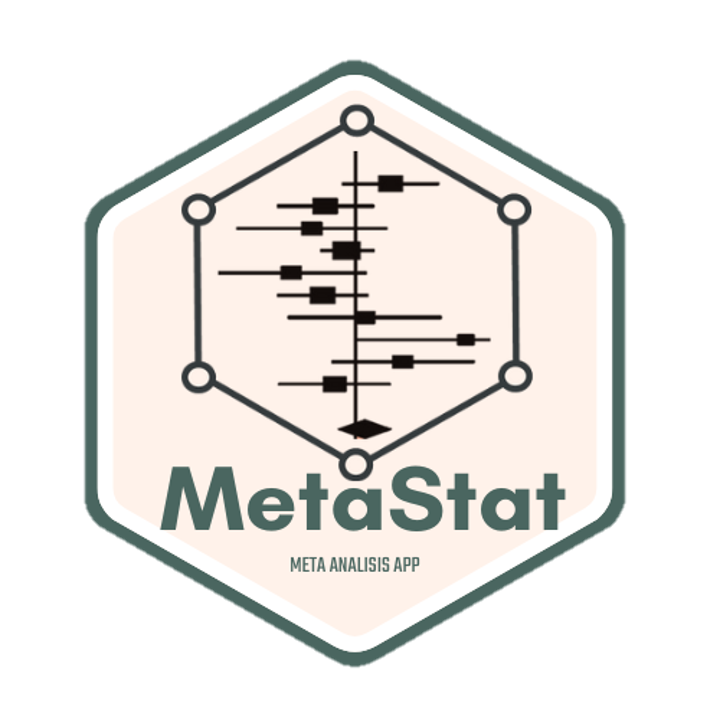

# MetaStat 

<!-- badges -->
[](https://github.com/FrancoMSuarez/MetaStat/actions)
[](https://opensource.org/licenses/MIT)
[](https://doi.org/10.5281/zenodo.20310380)

**MetaStat** is a free, open-source Shiny application for performing meta-analyses
of continuous and discrete outcomes—no R programming experience required.

## Features

- **10 meta-analysis models**: ratio of means, mean difference, standardized mean difference, correlations, single mean (continuous); odds ratio, risk ratio, risk
  difference, arcsine transformation, single proportion (discrete).
- Fixed-effect and random-effects estimation with multiple heterogeneity estimators.
- Subgroup analysis and meta-regression.
- Downloadable forest plots, funnel plots, and Baujat plots.
- Structured results tables (up to 9 tables per analysis).

## How to use

**Option 1 — Online (no installation):**
<https://francosuarez.shinyapps.io/metastats/>

**Option 2 — Install in R:**

```r
# install.packages("pak")
pak::pkg_install("FrancoMSuarez/MetaStat")
MetaStat::run_app()
```
## Screenshots

### Home


### Model configuration


### Forest plot


## License

MIT © Franco Suarez, Cecilia Bruno
